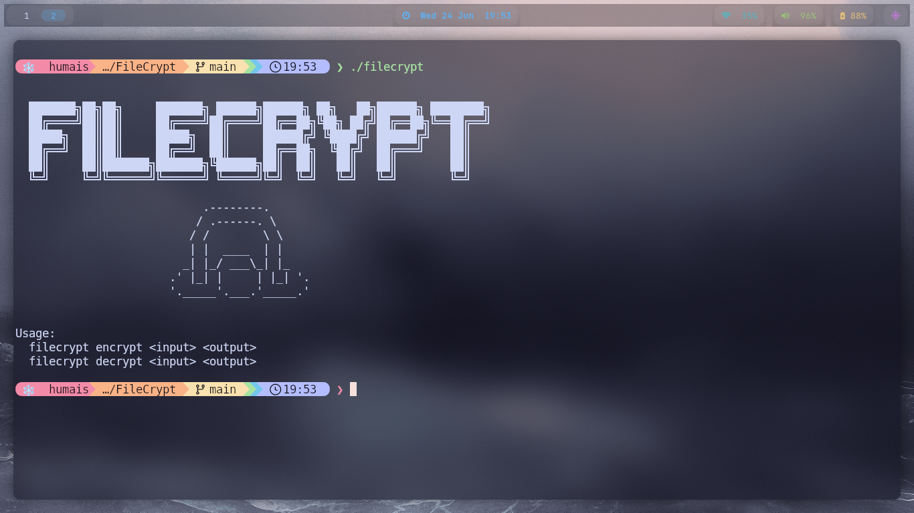

# 🔒 FileCrypt

<div align="center">

**A lightweight file encryption tool written in C++ using libsodium**

Password-based encryption • Argon2id • XSalsa20-Poly1305 • Cross-platform



</div>

---

## ✨ Features

* 🔐 Password-based file encryption
* 🛡️ Authenticated encryption using `crypto_secretbox`
* 🔑 Secure key derivation with Argon2id
* 🎲 Random salt generated for every file
* 🎲 Random nonce generated for every encryption operation
* 🚫 Detects incorrect passwords
* 🔍 Detects file tampering and corruption
* 💻 Cross-platform support (Linux, macOS, Windows)
* ⚡ Simple command-line interface

---

## 🧠 Cryptography

FileCrypt relies on proven cryptographic primitives provided by libsodium.

| Component      | Algorithm                  |
| -------------- | -------------------------- |
| Key Derivation | Argon2id (`crypto_pwhash`) |
| Encryption     | XSalsa20                   |
| Authentication | Poly1305                   |
| Encryption API | `crypto_secretbox`         |

### Encryption Flow

```text
Password
   │
   ▼
Argon2id + Salt
   │
   ▼
32-byte Key
   │
   ▼
XSalsa20-Poly1305
   │
   ▼
Encrypted File
```

---

## 🚀 Building

### Linux

```bash
sudo apt install libsodium-dev
g++ main.cpp -lsodium -O2 -o filecrypt
```

### macOS

```bash
brew install libsodium
g++ main.cpp -lsodium -O2 -o filecrypt
```

### Windows (MinGW)

```bash
g++ main.cpp -lsodium -O2 -o filecrypt.exe
```

---

## 📖 Usage

### Encrypt a File

```bash
./filecrypt encrypt secret.txt secret.enc
```

You'll be prompted to enter a password.

### Decrypt a File

```bash
./filecrypt decrypt secret.enc secret.txt
```

Enter the same password used during encryption.

### Example

```bash
$ ./filecrypt encrypt notes.txt notes.enc
Password: ********
Encrypted: notes.enc

$ ./filecrypt decrypt notes.enc notes.txt
Password: ********
Decrypted: notes.txt
```

---

## 📁 Encrypted File Format

```text
[SALT]
[NONCE]
[CIPHERTEXT + MAC]
```

The salt and nonce are stored in the encrypted file and are not secret.

---

## 🔐 Security Notes

* Every encrypted file receives a unique random salt.
* Every encryption operation uses a unique random nonce.
* Encryption keys are derived from the password and never stored.
* Modified or corrupted files will fail authentication.
* Incorrect passwords are detected automatically.

---

## 📜 License

Released under the MIT License.

---

<div align="center">

Made with ❤️ and libsodium and.... and what???

</div>
